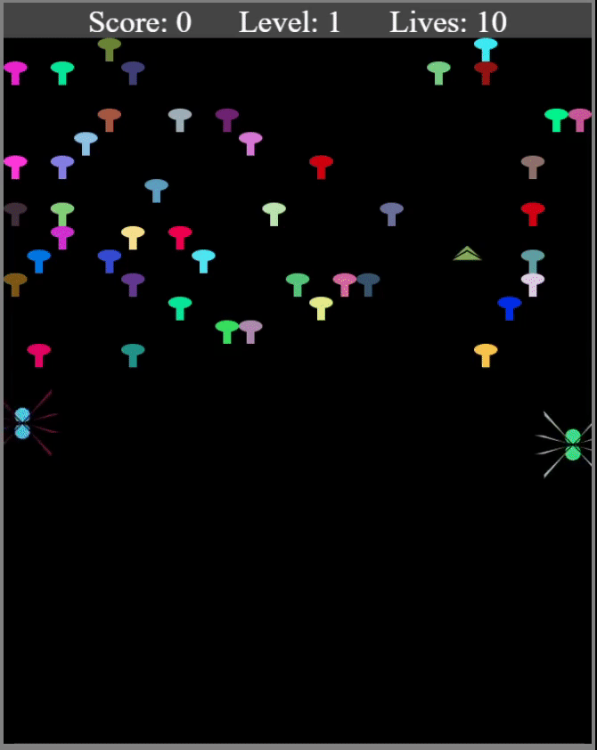

# Centipede.js
### <a href="https://miker704.github.io/Centipede.js/" target="_blank">Live Link</a>

<a href="https://miker704.github.io/Centipede.js/" target="_blank">**Centipede.js**</a> is a custom recreation of the classic 1981 Atari game Centipede
featuring not only the features of the orginal game but various custom featues including new enemies, behaviors, power ups, and game mechanics.
Players control the bug zapper shooting away at incoming enemies that invade the screen, fighting to survive for as long as possible and acheive the highest score.  

The main object for the player is to destroy the Centipede in order to progress to the next level. The Centipede body splits into multiple parts forming child Centipedes that will continue to run across the screen until destroyed by the player. However the player should be weary as they will encounter other enemies in the game including the return of Spiders, Fleas and Scorpions from the original game. Players should use the game Mushrooms by manipulating their spawn pattern and carve a way to provide cover from the centipede while they shoot away. However not all enemies are blocked by the mushrooms and can walk through easily. Players will earn a new life every 10000 points, unlike the orignal game players are not locked the bottom portion of the screen this does not make the game easier as it is necessary the game field will get very crowded at times and players will have to be fast and move around groups of enemies at whim.

This Goal of this project was for me to produce the orginal 1981 Atari game using pure Javascript and utilizing the HtML Canvas API to render and draw the games assets. This was achieved but I decided to take it further by adding my own custom features along with it including power ups, game mechanics new enemies and sproadic difficulty. I chose this project specifically due to the fact its one of the least recreated games, scarce amount of tutorials and resource forcing me to immplement everything on my own. Which resulted in a extremely difficult time as ever asset was drawn on the Canvas by hand, and all the algorithms for enemy movement, AI, ad behaviors all required a huge amount of advanced mathematics.

***
### **Warning - Its out of good heart, I should warn those that suffer from epilepsy/epileptic seizures this game does have alot of flashing colors and lights.**
***


## Technologies, Libraries, and APIs
- Vanilla ```JavaScript```
- ```HTML5```
- ```CSS3```
- ```Canvas``` API
- ```Babel```
- ```SASS```
- ```Webpack```
***

## Major Features and Code Highlights
  
### Centipede Movement
***


Creating the Centipede movement was actually pretty difficult, I have an copy of the orginal game and played it to analyze the movement of the Centipede.
Being that also Recreations of this game are very little I was still able to encounter the some pieces of assembly source code for the centipede's movement from the orginal game. Using my prior knowledge of writing Assembly Language in College I was able to put together most of the movement algorithm of the Centipede together, albeit I had to write a majority of the code that was missing in additon conform the code to operate within the 
canvas, something that is not accounted for in the orginal game. I used the movement algorithm of the snake from the classic snake game and attempted to 
modifiy it to be controlled by the computer instead of the player. There are many problems that arose with writing the movement algorithm at the 
current state of the code base the requirments for the canvas size and the calulations for each movement of the centipede are required to be so mathematically  precise in order to operate correctly or else bugs (no pun intended) such as the centipede getting stuck, flying of the canvas, refusing to move or at times appear normal only to leave the canvas on turning itself in a new direction never to return. A very mysterious bug included dealing with memory leakage resulting in a centipede of infinite length at level 3. The movement algorithm is the majority of the centipede's code due to the centipede's complex abilities. Whenever the Centipede encounters a wall it must turn either up or down in order to move to the next row of the canvas the same applies when walking into a group of mushrooms the centipede navigates between mushrooms using collision detection if it hits a mushroom it decides whether to move up or down sometimes slithering through groups of mushrooms in all directions which allows it to skip walking through multiple rows of the canvas fully in order to reach to the player. 

```.js

  move() {
    let newPos = [this.pos[0] + this.vel[0], this.pos[1] + this.vel[1]];
    let drop = this.game.allCentipedes.every((seg) => {
      seg.pos[0] > 0;
    })
    let splitSize;
    if (this.hitBottomOfCanvas(newPos)) {
        this.moveUp();
        splitSize = true;

    }
    else if (this.hitTopOfCanvas(newPos)) {
   
      let swap = this.vel[0];
      this.vel[0] = (this.vel[1]) * -1;
      this.vel[1] = swap;
      splitSize = true;
    }
    else if (this.hitSideWall(newPos) || this.centipedeCollatsMushroom(newPos)) {
   
      if (this.pos[1] === Util.centipedeLowestCorner()) {

        this.moveUp();
      }
      else {

        this.moveDown();
      }
      splitSize = true;
    }
    else if (this.reachedNextRow(newPos)) {

      this.newRow = null;
      this.vel[0] = -this.previousDirection;
      this.vel[1] = 0;
      let newRowPos = [this.pos[0] + this.vel[0], this.pos[1] + this.vel[1]];
      if (this.centipedeCollatsMushroom(newRowPos) || this.hitSideWall(newRowPos)) {

        this.vel[0] *= -1;
      }

      splitSize = true;
    }
    this.pos[0] += this.vel[0];
    this.pos[1] += this.vel[1];
    if (splitSize) {
      this.moveToNextRow();

    }
    if (this.game.outOfBounds(this.pos)) {
      this.game.removeEntity(this);
    }

  }

  moveUp() {
    this.vel[1] = -Math.abs(this.vel[0]);
    this.vel[0] = 0;

  }

  moveDown() {

    let nearestPos = Util.centipedeNearestPos(this.pos);
    this.nextRow = nearestPos[1] + (this.radius * 2);

    this.previousDirection = this.vel[0];
    this.vel[0] = this.vel[1];
    this.vel[1] = Math.abs(this.previousDirection);
  }

  reachedNextRow(newPos) {

    return this.nextRow && newPos[1] > this.nextRow;
  }


  hitSideWall(newPos) {

    return (newPos[0] < 12 && newPos[1] !== 48) || newPos[0] > Util.centipedeRightMostPos();
  }

  hitBottomOfCanvas(newPos) {

    return this.hitSideWall(newPos) && this.pos[1] === Util.centipedeLowestCorner();
  }

  hitTopOfCanvas(newPos) {

    return newPos[1] < Util.centipedeHeightLimit() && this.vel[1] < 0;
  }


  centipedeCollatsMushroom(newPos) {
    if (this.game.AllMushrooms.length === 0) {
      return;
    }
    let tempPos = this.pos;
    this.pos = newPos;
    let collided = this.game.AllMushrooms.some(
      (mushroom) => {
        return this.hasCollisonOccured(mushroom);
      }, this);

    this.pos = tempPos;
    return collided && this.vel[0];
  }


  moveToNextRow() {
    this.pos = Util.centipedeNearestPos(this.pos);
  }

  centipedePoisoned() {
    if (this.game.AllMushrooms.length === 0) {
      return;
    }

    let collided = this.game.AllMushrooms.some(
      (mushroom) => {
        this.mushroom = mushroom;
        return this.hasCollisonOccured(mushroom);
      }, this);
    if (this.mushroom.poisoned === true) {
      return true;
    }
    else {
      return false;
    }

  }

}

```

### Spider Movement Using Player Tracking
***


There are many different Algorithms that I created for the games entities one of the most impressive many found was the Player tracking alogrithim of the
Spider. The game features two types of spiders the normal and the Jumping Spider. The Jumping Spider retains most of the orginal games algorithm for movement although more chaotic. While the normal spider uses a player tracking algorithm to serve as its movement system. Once the spider enters the game it quickly identifies the player and ventures towards them able to track them , rotating and turning in any direction, chasing the player endlessly. It does this by estimating the radius and overall distance between it and the closest player using the Distance Formula <--- remember that from highschool ? it scans for the nearest entity that is a bugzapper (Player) and begins to move toward that direction. The higher the level the player is on the faster the spider's tracking becomes. 
This process starts off when the spider is spawned it is given a threshold for its ```maxVelocity``` for
the current level as the ```move()``` function is called the functions ```rotate()``` and ```increaseVelocity()``` are called constantly to
adjust the spiders current position and movement speed  ```rotate()``` when called calls another function ```findPlayer()``` which calculates the distance between it and the nearest bugzapper finding its current position and returning either ```angleOfTrajectory``` or ```this.direction```. Depending on the players position it decides on how to move for example if the player is close to the edges of the canvas the spider movement changes to use ```this.direction``` which makes the spider move towards to player in linear fashion while if the player is further within the map it uses ```angleOfTrajectory``` which allows the spider to move in a circular arc to the player. These movement adjustments
are needed to prevent the spider from going out of bounds when attacking the player. When these calculations are returned they are stored in the ```rotationAmount``` variable and the current direction is compared to the calculations of ```findPlayer()``` if it is greater than the current direction then it uses ```rotationAmount``` else it uses ```(rotationAmount*-1)``` to rotate the spider towards the players direction before calling ```increaseVelocity()``` to quickly close the gap between it and the player.


```.js

//From movement algorithm from the Spider Class
class Spider extends MovingObject {
    constructor(options) {

        super({
            pos: options.pos,
            radius: 21,
            vel: [0, 0],
            color: Util.randomColors(),
            game: options.game
        });

        this.direction = options.direction;
        this.maxVelocity = options.maxVelocity;

    }
      ... 

    move() {
        // increase the x,y position of the spider according to the increasing velocity, 
        // example starts moving 1 step at a time before moving 5, 10 or more at a time, as the level increases so does the default velocity 
        // allowing the spider to quickly close the gap between it and the player much faster
       
        this.pos[0] += this.vel[0];
        this.pos[1] += this.vel[1];

        //call the rotation function to turn around and make adjustments when the player tries to move away

        this.rotation();

        // increase the velocity of the spider after it adjusts itself to the players current direction so it can speed up and 
        // recover the distance between it and the player

        this.increaseVelocity();
    }

    findPlayer() {
        let x = this.pos[0] - this.game.zapper.pos[0];
        let y = this.pos[1] - this.game.zapper.pos[1];
        // if the calulation of both the current positons of the spider and player would lead the spider out of bounds 
        // proceed to adjust the direction of the spider of move in a linear fashion towards the player

        if (x === 0 || Math.abs(y / x) > 10) {
            this.direction = y < 0 ? Math.PI / 2 : -Math.PI / 2;
            return this.direction;
        }
        // if the current calculations would not yield to an out of bounds proceed to rotate in the players direction and proceed agressively
        // towards the player in a circular like fashion
        let angleofTrajectory = Math.atan(y / x);
        if (x > 0) { angleofTrajectory -= Math.PI; }
        return angleofTrajectory;
    }


    increaseVelocity(){

        // increase the speed of the spiders movement after rotation is called to quickly close the gap between it and the player

        let velocityofX = this.maxVelocity * Math.cos(this.direction);
        let velocityofY = this.maxVelocity *   Math.sin(this.direction);
        this.vel = [velocityofX,velocityofY];
    }

    rotation(){
        // depending on what is returned by find player rotate the spider towards to players direction 
        // if the current results of findplayer() is greater than current direction use the stored rotation results
        // which will either yield linear or circular movement

        let rotationAmount = Math.min(Math.abs(this.findPlayer()-this.direction),Math.PI/8);
        this.direction+= this.findPlayer()> this.direction ? rotationAmount : (rotationAmount*-1);
    }


}


```

### Complex Power Ups - Splay Bullets
***

There are many different power ups in the game from the simple extra life, and shield to the powerful wipeout that clears everything off the game field, that seems like the most powerful power up right? Well ... Theres a power up called Splay which is a bullet modifier that is so powerful that orginally it dropped the games frame rate to single digits for extended periods of time. Which led to introduce an extremely low proc chance about less than 0.01% even after attaining the power up to prevent the user from spamming it. In general a Splay bullet is a bullet that can be temporarily
unlocked for a short amount of time by picking up the splay power up. When firing there is a 0.01% chance for a bullet to spawn as a splay which is a 
green bullet that can behave in two different ways but regardless of behavior the splay is an explosive round that 'splays' out a large amount of bullets from the hit zone in 8 different directions 60 degrees per direction , basically the shape of a circle.  


Behavior 1 Phase Through Effect : Splay Travels through targets where anything that is hit or within the hit box radius of the splay will explode when the splay leaves the canvas this effect was inspired by the radius effect the BFG 9000 uses from Doom. <br/><br/>
  

Behavior 2 Phase Through Effect : Splay Travels and homes in an sticks to the closes target exploding after a few seconds before traveling ahead and sticking to the next target this continues till it leaves the map. <br/><br/>  


```.js
class Bullet extends MovingObject {
    constructor(options) {

        super({
            pos: options.pos,
            vel: options.vel,
            game: options.game,
            radius: options.radius || Bullet.RADIUS,
            color: '#FFFFFF'
        });

        this.splayable = options.splayable;
        this.otherColor = options.otherColor;
        this.childOfSplay = false;
        this.stuckWithSplay = false;

        if (this.otherColor) {
            this.color = this.otherColor;
        }

        this.splayShotDelete = true;
        this.splayChoice = Math.floor(Math.random() * (2 - 1 + 1)) + 1;
    }

    callFrag(entity) {

        this.pos[0] = this.pos[0]
        this.pos[1] = this.pos[1];

        for (let i = 1; i <= 8; i++) {
            let zapPositon = [entity.pos[0], entity.pos[1] - entity.radius / 8];
            let zapAngle = (Math.PI - 0.1 * (360 / i));
            let zapX = 10 * Math.cos(zapAngle);
            let zapY = (-10) * Math.sin(zapAngle);

            this.game.allBullets.push(
                new Bullet({
                    game: this.game,
                    pos: zapPositon.slice(),
                    vel: [zapX, zapY],
                    otherColor: '#FF0000',
                    radius: 5,
                    splayable: false,
                    childOfSplay: true,
                })
            )
        }

        this.splayShotDelete = true;
        this.stuckWithSplay = false;
    }

    //check if the bullet collides with some destroyable entity
    collisonDetection(entity) {

        if (this.game.zapper.hasSplayShot === true &&
            this.splayable === true &&
            this.childOfSplay === false

        ) {
            this.splayShotDelete = false;
            this.color = '#50C878';
            this.radius = 8;
            if (entity instanceof Mushrooms ||
                entity instanceof Spider ||
                entity instanceof Centipede ||
                entity instanceof Scorpion ||
                entity instanceof Flea ||
                entity instanceof ArmoredScorpion ||
                entity instanceof Wasp ||
                entity instanceof JumpingSpider ||
                entity instanceof LightningWasp
            ) {
                this.stuckWithSplay = true;
                if (this.splayable === true && this.stuckWithSplay === true) {

                    //splay shot can have 2 random effects 
                    // pass through splaying where shot pass through and 
                    // causes each pass to splay everything it passes through
                    //or it will stick to an enemy explode splaying then
                    // that same round will travel forward attaching another
                    // object splaying again till it leaves the map
                    
                    if (this.splayChoice === 2) {
                        setTimeout(() => {
                            this.callFrag(entity);
                        }, 1000)
                    }
                    else {
                        setTimeout(() => {
                            this.pos[0] = entity.pos[0]
                            this.pos[1] = entity.pos[1]
                            this.callFrag(entity);
                        }, 1000)

                        this.pos[0] = entity.pos[0]
                        this.pos[1] = entity.pos[1]
                    }

                }
                this.stuckWithSplay = false;
            }
        }

        else if (this.splayShotDelete === true || this.childOfSplay === true) {
            if (entity instanceof Mushrooms ||
                entity instanceof Spider ||
                entity instanceof Centipede ||
                entity instanceof Scorpion ||
                entity instanceof Flea ||
                entity instanceof ArmoredScorpion ||
                entity instanceof Wasp ||
                entity instanceof JumpingSpider ||
                entity instanceof LightningWasp
            ) {
                entity.hitByZapper(); // call to remove entity
                this.game.removeEntity(this); // remove the bullet from the game 
            }
        }
    }

}

Bullet.SPEED = 15;
Bullet.RADIUS = 6;
export default Bullet;

```


***

### Acknowledgments
I would like to acknowledge that the following were invaluable to understanding and using the concepts that made **Centipede.js** possible:

* AppAcademy, for teaching me tons about Software Development and how to build projects from the ground-up to run on webpages, since this was my first time building a game in JavaScript with classes this was new to me alot of bugs were encoutered. 
* My Professors from CUNY York College that have taught me an extreme wealth of knowledge that aided me in speeding up development of this project, by being able to identify and solve application breaking bugs such as a memory leak issue that lead to inifinite length centipedes making the game impossible to reach past level 3, my past projects allowed me to identify this bug and its root cause. 
* My fellow colleagues from the ModDB.com whom I frequently worked along with, contributing to their projects, by allowing me to embrace using my own creativity to make a project like this one unique and not just an uninspired piece of work. 


***

### Future
In the future I will be updating this project, providing fixes and an overhaul of the entire project of **Centipede.js**

#### These include:
* The Centipede, and other Entity movement utilize a precise amount of space of the canvas that is perfectly divisible by the entire canvas
area. This restricts the canvas size So the majority of the app will be re-coded using an already written but not utilized function that divides
up the canvas properly regardless of its size allowing the centipede and other entities to move with perfectly divisible spaces. The use of this
function will cause a need to re-factor/code the majority of the code base.  
* Centipede Movement: when hitting a poison mushroom it should immediately drop down to the bottom of the canvas, at the moment this effect causes unpredictable behaviors leaving it uninvoked to prevent bugs. 
* Centipede Movement: Since the player is able to move unrestricted on the canvas unlike the traditional game the centipede should be able to 
move back to the top of the canvas once it reaches the bottom.
* Upon reaching levels past 120, Player bullets and the Centipede suffer issues such as the centipede moves so fast the gaps between its segments are massive,
rare occassions it may even fly off the map, the players bullets hit boxes operate in a weird fashion requiring to be at a certain range in 
order to hit anything also seems that the bullets do not travel very far at all.
* Optimizations to performance especially on higher levels.
* Recoding of the Splay power up the splay power up at times has inconsistent behaviors
* Increase the size of the canvas, option for fullscreen gameplay
* Refactoring of ui
* Adding Sound effects
* Added the ability to pause the game.
* A way to record and keep highscores.